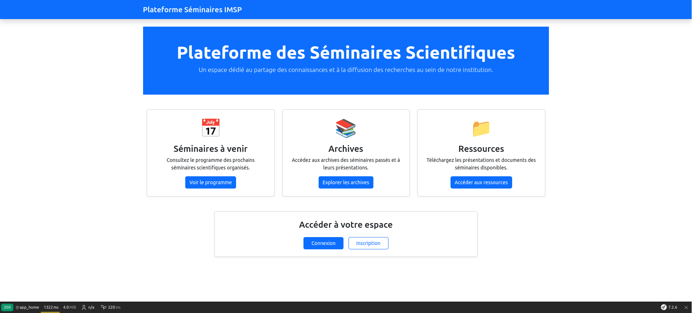

## Présentation du projet
    Pour la réalistion de ce projet j'ai utilisé boostrap , symphony,mariadb , phpmyadmin
    docker , docker compose, nginx et puis vscode . Pour résumer chaque personne peut s'inscrire en tant que administrateur ou un présenteur de 
    theme  afin de se connecter à son propre espace . L'espace presenteur  permet de faire un suivi de ses demandes , de soummettre ses demandes.
    Alors que l'espace administrateur permet de voir tous les demandes envoyées et de pouvoir valider ou non les demandes puis de les programmées . Enfin j'ai des pages publics c'est-à-dire 
    tout le monde à acces a ces pages pour pouvoir voir les semiaires programmés afin d'y assiter ou de télécharger des séminaires passées(archives) 

### Page d'accueil

### Formulaire de connexion

## Comment exécuter ce projet

1. Installer Docker et docker-compose
2. Executer la commande suivante dans le dossier ou se trouve compose.yml : docker compose up -d --build
3. Pas besoin d'utiliser xammp , les services nginx , mariadb , phpmyaadmin , symphony vont se mettre en place une fois exécuter la commande ci dessus
4. Accéder à la page d'accueil: http://localhost:8090/
