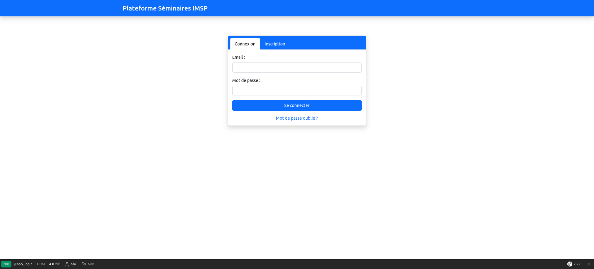
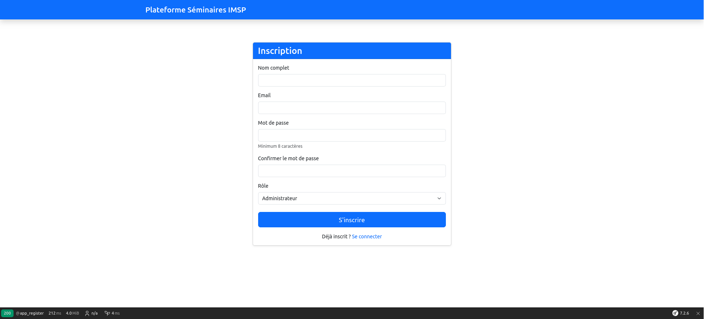

📚 Plateforme de Gestion des Séminaires

Ce projet est une plateforme web complète développée pour faciliter la gestion, la programmation et la consultation de séminaires académiques ou professionnels. Il repose sur une architecture moderne avec Docker et Symfony, et propose des interfaces adaptées aux différents types d'utilisateurs.
🛠️ Technologies utilisées

    Symfony – Framework PHP pour une structure MVC robuste

    MariaDB – Système de gestion de base de données relationnelle

    phpMyAdmin – Interface d'administration de la base de données

    Bootstrap – Framework CSS pour une interface responsive et moderne

    Docker & Docker Compose – Conteneurisation de l'application pour faciliter le déploiement

    Nginx – Serveur web utilisé comme reverse proxy

    VS Code – Environnement de développement

👤 Types d'utilisateurs
1. Présentateur

Les utilisateurs inscrits comme présentateurs disposent d'un espace personnel leur permettant de :

    Soumettre des demandes de séminaire

    Suivre le statut de leurs demandes

2. Administrateur

Les administrateurs ont accès à un espace de gestion permettant :

    De consulter toutes les demandes soumises

    De valider ou refuser les demandes

    De programmer les séminaires acceptés

🌍 Pages publiques

Les visiteurs non connectés peuvent :

    Consulter la liste des séminaires programmés

    Télécharger les présentations des séminaires passés (archives)

    Accéder aux informations générales de la plateforme

🚀 Fonctionnalités principales

    Authentification sécurisée (administrateur ou présentateur)

    Soumission et suivi des demandes de séminaire

    Validation, refus et programmation des séminaires par les administrateurs

    Affichage des séminaires ouverts au public

    Téléchargement des archives des séminaires

    Interface responsive avec Bootstrap

    Déploiement simplifié grâce à Docker et Docker Compose

### Page d'accueil

### Formulaire de connexion

### Formulaire d'inscription

## Comment exécuter ce projet

1. Installer Docker et docker-compose
2. Executer la commande suivante dans le dossier ou se trouve compose.yml : docker compose up -d --build
3. Pas besoin d'utiliser xammp , les services nginx , mariadb , phpmyaadmin , symphony vont se mettre en place une fois exécuter la commande ci dessus
4. Accéder à la page d'accueil: http://localhost:8090/
